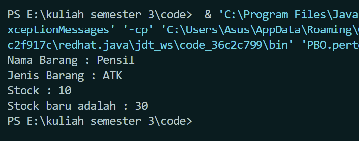

Nama : Achmad MUfid
Kelas : TI-1C
NIM : 2241720159

1.  Jalankan program tersebut! 
    
2.  Apakah fungsi argumen dalam suatu method? 
    Untuk memberikan data atau informasi yang diperlukan oleh method untuk melakukan tugasnya. 
3.  Ambil kesimpulan tentang kegunaan dari kata kunci return , dan kapan suatu method
    harus memiliki return 
    "return" digunakan untuk mengembalikan nilai dari suatu method,Suatu method harus memiliki "return" jika itu dirancang untuk menghasilkan nilai atau jika Anda ingin menghentikan eksekusi method dan mengembalikan kendali ke pemanggilan method.
