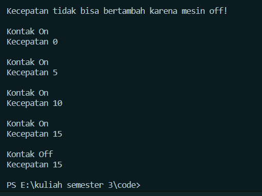

Nama : Achmad MUfid
Kelas : TI-1C
NIM : 2241720159

hasil percobaan 2


1. Pada class TestMobil, saat kita menambah kecepatan untuk pertama kalinya, mengapamuncul peringatan “Kecepatan tidak bisa bertambah karena Mesin Off!”?<br>
   dikarenakan kondisi untuk fungsi tambahKecepatan adalah kontakOn = "true", sedangkan kontakOn memiliki nilai = "false".
2. Mengapat atribut kecepatan dan kontakOn diset private? <br>
   Agar dalam mengatur ulang atau mengambil data itu harus perlu akses method yang ada didalam class tersebut tanpa menyentuh langsung atributnya.
3. Ubah class Motor sehingga kecepatan maksimalnya adalah 100!<br>

```java
    public void tambahKecepatan() {
        if (kontakOn == true) {
            kecepatan += 5;
            if(this.kecepatan == 100){
                kurangiKecepatan();
            }
        } else {
            System.out.println("Kecepatan tidak bisa bertambah karena mesin off!\n");
        }
    }
```
