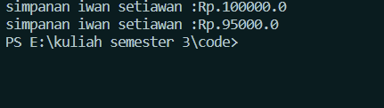
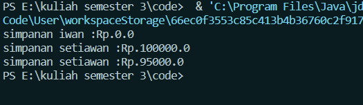

Nama : Achmad MUfid
Kelas : TI-1C
NIM : 2241720159

hasil percobaan 3

<br>
hasil percobaan 4

<br>

1. Apa yang dimaksud getter dan setter?<br>
   untuk mengakses dan memodifikasi nilai atribut (variabel) dalam sebuah objek. Dengan menggunakan getter dan setter, Anda dapat mengimplementasikan konsep encapsulation, yang memungkinkan Anda untuk melindungi data dalam objek dan mengendalikan cara data tersebut diakses atau dimodifikasi dari luar objek.
2. Apa kegunaan dari method getSimpanan()?<br>
   untuk menampilkan jumlah simpanan.
3. Method apa yang digunakan untk menambah saldo?<br>
   method yang digunakan untuk menambah saldo adalah

```java
    public void setor(float uang) {
        simpanan += uang;
    }
```

4. Apa yand dimaksud konstruktor?<br>
   onstruktor adalah metode khusus yang digunakan untuk menginisialisasi objek dari sebuah kelas.
5. Sebutkan aturan dalam membuat konstruktor?<br>
   konstruktor memiliki nama yang sama dengan nama kelasnya dan tidak mengembalikan nilai.
6. Apakah boleh konstruktor bertipe private?<br>
   Ya, konstruktor dapat didefinisikan sebagai private. Ketika suatu konstruktor dinyatakan sebagai private, itu berarti konstruktor tersebut hanya dapat diakses dari dalam kelas tempat ia didefinisikan.
7. Kapan menggunakan parameter dengan passsing parameter?<br>
   Digunakan jika tidak perlu method setter getter
8. Apa perbedaan atribut class dan instansiasi atribut?<br>
   atribut kelas terkait dengan kelas itu sendiri dan dibagi oleh semua instance, sementara instansiasi atribut terkait dengan instance individu dan memiliki nilai yang terpisah untuk setiap instance.
9. Apa perbedaan class method dan instansiasi method?<br>
   method class adalah method yang digunakan dalam class tersebut, sedangkan instansiasi method adalah method yang digunakan dalam class lain melalui instansiasi class tersebut.
