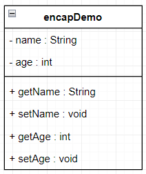
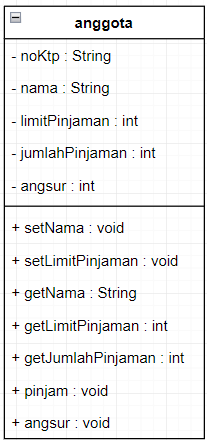
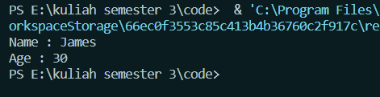
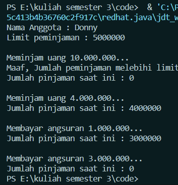

Nama : Achmad MUfid
Kelas : TI-1C
NIM : 2241720159

- uml tugas 1
  

- uml tugas 2
  

1. Cobalah program dibawah ini dan tuliskan hasil outputnya
   

2. Pada program diatas, pada class EncapTest kita mengeset age dengan nilai 35, namun pada
   saat ditampilkan ke layar nilainya 30, jelaskan mengapa.<br>
   karena ada pengecekan di dalam method setAge dimana jika age lebih dari 30 maka age = 30.<br>

```java
        if (age > 30) {
            this.age = 30;
        } else {
            this.age = age;
        }
```

3.  Ubah program diatas agar atribut age dapat diberi nilai maksimal 30 dan minimal 18<br>

```java
        if (age <= 18 || age >= 30) {
        this.age = 0;
        } else {
        this.age = age;
        }
```

4. Pada sebuah sistem informasi koperasi simpan pinjam, terdapat class Anggota yang memiliki
   atribut antara lain nomor KTP, nama, limit peminjaman, dan jumlah pinjaman. Anggota
   dapat meminjam uang dengan batas limit peminjaman yang ditentukan. Anggota juga dapat
   mengangsur pinjaman. Ketika Anggota tersebut mengangsur pinjaman, maka jumlah
   pinjaman akan berkurang sesuai dengan nominal yang diangsur. Buatlah class Anggota
   tersebut, berikan atribut, method dan konstruktor sesuai dengan kebutuhan. Uji dengan
   TestKoperasi berikut ini untuk memeriksa apakah class Anggota yang anda buat telah sesuai
   dengan yang diharapkan.<br>
   

5. Modifikasi soal no. 4 agar nominal yang dapat diangsur minimal adalah 10% dari jumlah
   pinjaman saat ini. Jika mengangsur kurang dari itu, maka muncul peringatan “Maaf,
   angsuran harus 10% dari jumlah pinjaman”.<br>

```java
    public void angsur(int angsur) {
        int minimAngsur = (10 * this.jumlahPinjaman) / 100;
        if (angsur < minimAngsur) {
        System.out.println("Maaf, angsuran harus minimal 10% dari jumlah pinjaman saait ini");
        } else {
        this.jumlahPinjaman = this.jumlahPinjaman - angsur;
        }
        this.jumlahPinjaman = this.jumlahPinjaman - angsur;
    }
```

6.  Modifikasi class TestKoperasi, agar jumlah pinjaman dan angsuran dapat menerima input
    dari console<br>

```java
                Scanner input = new Scanner(System.in);
                anggota donny = new anggota("111333444", "Donny", 5000000);
                System.out.println("Nama Anggota : " + donny.getNama());
                System.out.println("Limit peminjaman : " + donny.getLimitPinjaman());

                System.out.println("\nMeminjam uang Rp.10.000.000");
                donny.pinjam(10000000);
                System.out.println("Jumlah pinjaman saat ini : Rp." +
                donny.getJumlahPinjaman());

                int pinjam;
                System.out.print("Masukkan pinjaman : ");
                pinjam = input.nextInt();
                donny.pinjam(pinjam);

                System.out.println("\nMeminjam uang : Rp." + pinjam);
                System.out.println("Jumlah pinjaman saat ini : Rp." +
                donny.getJumlahPinjaman());

                System.out.println("\nMembayar angsuran 1.000.000...");
                donny.angsur(1000000);

                int angsur;
                System.out.print("Masukkan pinjaman : ");
                angsur = input.nextInt();
                donny.angsur(angsur);

                System.out.println("Jumlah pinjaman saat ini : Rp." +
                donny.getJumlahPinjaman());
                System.out.println("\nMembayar angsuran : Rp." + angsur);
                System.out.println("Jumlah pinjaman saat ini : Rp." +
                donny.getJumlahPinjaman());
```
