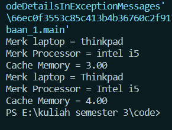

<h2>Nama : Achmad Mufid<br>
Kelas :TI-1C<br>
NIM : 2241720159</h2>

<h3>Hasil Percobaan</h3>


<h3>Pertanyaan</h3>

1. Di dalam class Processor dan class Laptop , terdapat method setter dan getter untuk masing‑masing atributnya. Apakah gunanya method setter dan getter tersebut ?<br>

   Metode setter digunakan untuk mengubah nilai atribut, sedangkan metode getter digunakan untuk mengambil nilai atribut.

2. Di dalam class Processor dan class Laptop, masing‑masing terdapat konstruktor default dan konstruktor berparameter. Bagaimanakah beda penggunaan dari kedua jenis konstruktor tersebut ?<br>

   - Konstruktor default adalah konstruktor tanpa parameter yang dibuat secara otomatis jika tidak ada konstruktor kustom yang didefinisikan dalam kelas.<br>
   - Konstruktor berparameter adalah konstruktor yang memiliki parameter dan digunakan untuk menginisialisasi objek dengan nilai-nilai yang diberikan.

3. Perhatikan class Laptop, di antara 2 atribut yang dimiliki (merk dan proc), atribut manakah yang bertipe object ?<br>

   proc adalah atribut yang bertipe object, yaitu object processor.

4. Perhatikan class Laptop, pada baris manakah yang menunjukan bahwa class Laptop memiliki relasi dengan class Processor ?<br>

   ```java
   private String merk;
   private processor proc;
   ```

   disitu menunjukan bahwa laptop memiliki atribut bertipe processor.

5. Perhatikan pada class Laptop , Apakah guna dari sintaks proc.info() ?<br>
   Sintaks tersebut berguna untuk memanggil method yang berada pada objek processor yaitu :

   ```java
       public void info() {
       System.out.printf("Merk Processor = %s\n", merk);
       System.out.printf("Cache Memory = %.2f\n", cache);
   }
   ```

   method tersebut berfungsi untuk menampilkan merk dan cahce processor.

6. Pada class MainPercobaan1, terdapat baris kode:

   ```java
   Laptop l = new Laptop("Thinkpad", p);.
   ```

   Apakah p tersebut ?
   Dan apakah yang terjadi jika baris kode tersebut diubah menjadi :

   ```java
   Laptop l = new Laptop("Thinkpad", new Processor("Intel i5", 3));
   ```

   Bagaimanakah hasil program saat dijalankan, apakah ada perubahan ?

   p adalah objek processor yang sudah di instansiasi sebelumnya, dan tidak ada perubahan antara kedua kode tersebut karena pada dasarnya kedua kode tersebut sama, bedanya adalah pada kode yang kedua objek processor diinstansiasi didalam instansiasi objek laptop.
