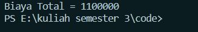

<h2>Nama : Achmad Mufid<br>
Kelas :TI-1C<br>
NIM : 2241720159</h2>

<h3>Hasil Percobaan</h3>


<h3>Pertanyaan</h3>

1.  Perhatikan class Pelanggan. Pada baris program manakah yang
    menunjukan bahwa class Pelanggan memiliki relasi dengan class Mobil dan class Sopir ?<br>

        ```java
         private String nama;
         private int hari;
         private mobil m;
         private sopir s;
        ```

    pada kode program tersebut terdapat atribut yang berupa objek.

2.  Perhatikan method hitungBiayaSopir pada class Sopir, serta method
    hitungBiayaMobil pada class Mobil. Mengapa menurut Anda method tersebut harus memiliki argument hari ?<br>

    Agar nanti jika method tersebut dipanggil di class lain maka nilai hari tersebut dapat diubah.

3.  Perhatikan kode dari class Pelanggan. Untuk apakah perintah
    mobil.
    hitungBiayaMobil(hari) dan sopir.hitungBiayaSopir(hari)?

    kode program tersebut berguna untuk memanggil method yang berada pada objek mobil dan supir yang berguna untuk menghitung biaya mobil dan sopir per hari.

4.  Perhatikan class MainPercobaan2. Untuk apakah sintaks
    p.setMobil(m)dan p.setSopir(s)?
    <br>

    kode program tersebut digunakan untuk mengubah nama mobil dan sopir dari objek pelanggan.

5.  Perhatikan class MainPercobaan2. Untuk apakah proses p.hitungBiayaTotal()
    tersebut ?<br>

    untuk menjumlahkan biaya mobil dan sopir.

6.  Perhatikan class MainPercobaan2, coba tambahkan pada baris terakhir dari method
    main dan amati perubahan saat di‑run!
    System.out.println(p.getMobil().getMerk()) Jadi untuk apakah sintaks p.getMobil().getMerk() yang ada di dalam method main tersebut?<br>

    untuk menampilkan merk mobil melewati objek pelanggan.
