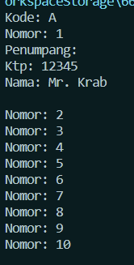

<h2>Nama : Achmad Mufid<br>
Kelas :TI-1C<br>
NIM : 2241720159</h2>

<h3>Hasil Percobaan</h3>


<h3>Pertanyaan</h3>

1. Pada main program dalam class MainPercobaan4, berapakah jumlah kursi dalam
   Gerbong A ?
2. Perhatikan potongan kode pada method info() dalam class Kursi. Apa maksud kode
   tersebut ?

```java
if (this.penumpang != null) {
info += "Penumpang: " + penumpang.info() + "\n";
}
```

3. Mengapa pada method setPenumpang() dalam class Gerbong, nilai nomor dikurangi
   dengan angka 1 ?
4. Instansiasi objek baru budi dengan tipe Penumpang, kemudian masukkan objek baru
   tersebut pada gerbong dengan gerbong.setPenumpang(budi, 1). Apakah yang terjadi ?
5. Modifikasi program sehingga tidak diperkenankan untuk menduduki kursi yang sudah ada
   penumpang lain !
