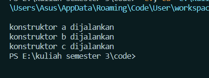

### Nama : Achmad Mufid

### Kelas : TI - 1C

### NIM : 2241720159

## Pertanyaan

1. Pada percobaan 4 sebutkan mana class yang termasuk superclass dan subclass, kemudian jelaskan alasannya!<br>
   Jawab :<br>

- classA adalah superclass tanpa superclass lain. Itu adalah kelas paling atas dalam hierarki.
- classB adalah subclass dari classA dan superclass untuk classC.
  dikarenakan classB extend classA.
- classC adalah subclass dari classB.
  dikarenakan classC extend classB.

2. Ubahlah isi konstruktor default ClassC seperti berikut.

```java
public class classC extends classB {
    classC() {
        super();
        System.out.println("konstruktor c dijalankan");
    }
}
```

jawab :<br>


3. Ketika mengubah posisi super() dibaris kedua dalam kontruktor defaultnya dan terlihat ada error. Kemudian kembalikan super() kebaris pertama seperti sebelumnya, maka errornya akan hilang. Perhatikan hasil keluaran ketika class Percobaan4 dijalankan. Kenapa bisa tampil output seperti berikut pada saat instansiasi objek test dari class ClassC<br>
   Jawab : <br>
   ClassC adalah subclass atau pewarisan dari ClassB sehingga jika instansiasi objek adalah ClassC secara otomatis output ClassB akan mengikuti dan ClassB sendiri adalah subclass dari ClassA sehingga output ClassApun mengikuti sebagaimana ClassB adalah pewarisan ClassB.

4. Apakah fungsi super() pada potongan program dibawah ini di ClassC!<br>

```java
public class classC extends classB {
    classC() {
        super();
        System.out.println("konstruktor c dijalankan");
    }
}
```

Jawab :<br>
Guna untuk memanggil konstruktor superclass atau parent class
