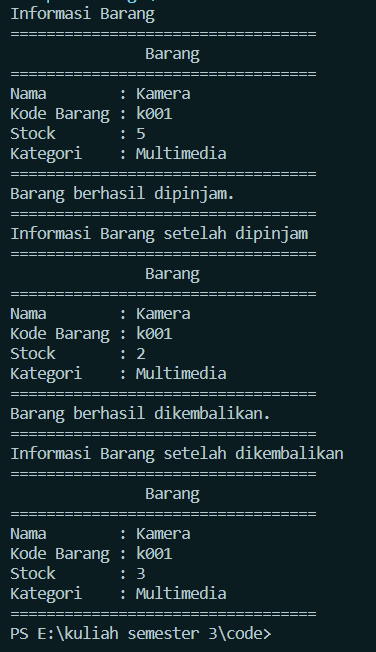

<h2>Nama : Achmad Mufid<br>
Kelas :TI-1C<br>
NIM : 2241720159</h2>

<h2>Quiz 1<h2>
1. Class dan Object:<br>

- Apa yang dimaksud dengan "class" dalam pemrograman berorientasi objek?<br>
  Jawab :<br>
  Class adalah template untuk menciptakan objek. Class mendefinisikan atribut dan method yang akan dimiliki oleh objek dari class tersebut.
- Bagaimana Anda mendefinisikan objek dari suatu class dalam bahasa pemrograman Java?<br>
  jawab :<br>
  Melakukan instansiasi dalam class main.
- Misalkan Anda memiliki class "Barang" dalam sistem informasi inventaris. Bagaimana Anda akan membuat objek "laptop" dari class tersebut?<br>
  jawab :<br>
  ```java
  Barang laptop = new Barang();
  ```

2. Encapsulation:<br>

- Jelaskan konsep encapsulation dalam pemrograman berorientasi objek dan mengapa hal ini penting dalam pengembangan sistem informasi inventaris barang.<br>
  jawab :<br>
  Encapsulation adalah konsep dalam OOP yang melibatkan pembungkusan atribut dan metode dalam class, sehingga hanya metode yang ditentukan yang dapat mengakses dan mengubah nilai atribut tersebut.
- Dalam konteks sistem informasi inventaris, sebutkan contoh atribut (variabel) yang
  harus di-encapsulate dan mengapa.<br>
  jawab :<br>
  kodeBarang : setiap kode barang itu unik dan tidak sama, maka perlu dijaga konsistensi datanya dengan enkapsulasi.
  jumlah : agar perubahan jumlah barang dapat terkontrol melalui method getter and setter.

3. Relasi Kelas:<br>

- Apa yang dimaksud dengan relasi antara kelas dalam pemrograman berorientasi
  objek?<br>
  jawab :<br>
  Relasi antara kelas dalam OOP menggambarkan bagaimana kelas-kelas berinteraksi satu sama lain dalam suatu sistem.
- Dalam sistem informasi inventaris barang, bagaimana Anda akan menggambarkan relasi antara kelas "Barang" dan kelas "Kategori"?<br>
  jawab :<br>
  class Barang dan class Kategori memiliki relasi dimana setiap dari Barang memiliki kategori tertentu. Misalnya ada objek seperti sapu dan Pel, kedua objek Barang ini masuk ke kategori kebersihan.

4. PBL:

- Berdasarkan kasus sistem informasi inventaris barang, coba buat sebuah class
  sederhana beserta atribut dan metodenya yang menggambarkan suatu entitas
  dalam sistem tersebut (misalnya, class "Barang").<br>
  jawab :<br>

  ```java
  public class barang {
    private String nama;
    private String kodeBarang;
    private int stock;
    private kategori kategori;

    public barang(String nama, String kodeBarang, int stock, kategori kategori) {
        this.nama = nama;
        this.kodeBarang = kodeBarang;
        this.stock = stock;
        this.kategori = kategori;
    }

    public String getNama() {
        return nama;
    }

    public void setNama(String nama) {
        this.nama = nama;
    }

    public String getKodeBarang() {
        return kodeBarang;
    }

    public void setKodeBarang(String kodeBarang) {
        this.kodeBarang = kodeBarang;
    }

    public int getStock() {
        return stock;
    }

    public void setStock(int stock) {
        this.stock = stock;
    }

    public kategori getKategori() {
        return kategori;
    }

    public void pinjamBarang(int jumlahDipinjam) {
        if (jumlahDipinjam <= stock) {
            stock -= jumlahDipinjam;
            System.out.println("Barang berhasil dipinjam.");
            System.out.println("==================================");
        } else {
            System.out.println("Stok barang tidak mencukupi untuk dipinjam.");
            System.out.println("===========================================");

        }
    }

    public void kembalikanBarang(int jumlahDikembalikan) {
        stock += jumlahDikembalikan;
        System.out.println("Barang berhasil dikembalikan.");
        System.out.println("==================================");
    }

    public void infoBarang() {
        System.out.println("==================================");
        System.out.println("               Barang             ");
        System.out.println("==================================");
        System.out.println("Nama        : " + nama);
        System.out.println("Kode Barang : " + kodeBarang);
        System.out.println("Stock       : " + stock);
        System.out.println("Kategori    : " + kategori.getNama());
        System.out.println("==================================");
    }

  }
  ```

- Bagaimana Anda akan menggunakan encapsulation untuk melindungi atributatribut dalam class tersebut?<br>
  jawab : <br>

  ```java
    private String nama;
    private String kodeBarang;
    private int stock;
    private kategori kategori;
  ```

- Gambarkan hierarki class atau hubungan antar class yang mungkin ada dalam sistem informasi inventaris barang di jurusan Teknologi Informasi. Berikan contoh relasi antar class (misalnya, inheritance atau association) dalam konteks tersebut.<br>
jawab :<br>
saya membuat dua kelas yaitu kelas barang dan kelas kategori dimana setiap barang memiliki kategori. dan hal tersebut termasuk kedalam hubungan inheritance.<br>
untuk kode bisa dilihat disini<br>
[barang](barang.java)<br>
[kategori](kategori.java)<br>
[main](main.java)<br>

  <h3> Hasil </h3>
  
