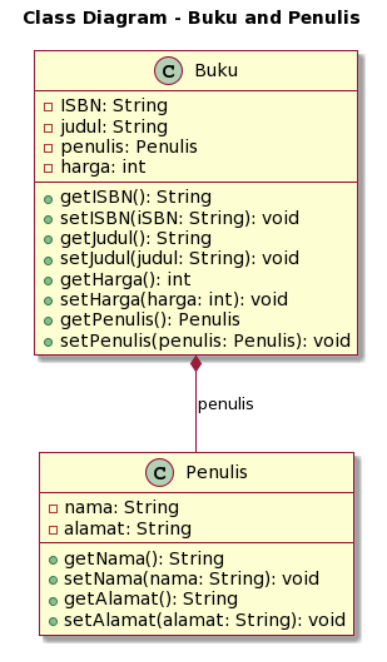

### Nama : Achmad Mufid

### Kelas : TI-2C

### NIM : 2241720159

### UTS OOP

1. Berdasarkan contoh class ClassA di bawah ini, jelaskan apakah penulisan source code pada contoh class tersebut sudah benar. Jika tidak, apa yang perlu diperbaiki?<br>

   ```java
   public class ClassA {
       float f1 = 0.15f;
       float hitung() {
           float x = 2f * f1;
       }
   }
   ```

   Jawab :<br>
   Penulisan pada code diatas kurang tepat,perlu ditambahkan return x; untuk mengembalikan nilai x.<br>
   [classA](./no_1/classA.java)<br>

2. Pada class SoalArray1, terdapat array 2 dimensi dengan ukuran 3x3. Tuliskan code Java untuk menghitung jumlah total elemen array tersebut dengan menggunakan perulangan.<br>

   ```java
   public class SoalArray1 {
       public static void main(String[] args) {
           int[][] arrayInt = {{1, 1, 4}, {2, 1, 2}, {3, 2, 1}};
       // hitung jumlah elemen array 2 dimensi
       // gunakan perulangan
       }
   }
   ```

   Jawab :<br>
   [menghitung array menggunakan perulangan](./no_2/soalArray1.java)<br>

3. Pada source code yang diberikan, class ClassY merupakan turunan dari class Class. Sebutkan atribut dan method apa saja yang diwarisi oleh ClassY dari kelas induknya (class Class). Jelaskan juga apa output dari code yang ditulis pada class ClassY dan bagaimana nilai tersebut diperoleh.<br>

   ```Java
   public class Class {
       int a = 2;
       int x = 0;

       int hitung() {
           x = x + 5 * a;
           return x;
       }
   }
   public class ClassY extends Class {
       int b = 5;
       int y = 0;
       int hitungY() {
           y = hitung() * b;
           return y;
       }
   public static void main(String[] args) {
       ClassY cy = new ClassY();
       System.out.println(cy.hitungY());
   }
   }
   ```

   Jawab :<br>
   Kelas ClassY mewarisi atribut a dan x dari kelas Class, serta method hitung() yang mengubah nilai atribut x dengan menambahkannya dengan 5 \* a. Output dari kode pada class ClassY adalah 50, yang diperoleh dengan menggabungkan nilai atribut a dan b, dan melalui perhitungan di dalam method hitung() dan hitungY().

4. Dalam class Mahasiswa, lengkapi code dengan:

   - Menambahkan constructor untuk mengisi atribut nim, nama, alamat, dan jenisKelamin.
   - Membuat objek mahasiswa dan mengisi atribut nim, nama, alamat, dan jenisKelamin melalui constructor.

   ```java
   public class Mahasiswa {
       String nim, nama, alamat;
       char jenisKelamin;

       // a. Tambahkan constructor
       // Gunakan constructor untuk
       // mengisi atribut nim, nama, alamat, jenisKelamin

   public static void main(String[] args) {
       // b. Buat objek mahasiswa
       // Isi atribut nim, nama, alamat, jenisKelamin
       // lewat constructor
   }
   }
   ```

   Jawab :<br>
   [Menambahkan constructor](./no_4/mahasiswa.java)<br>
   [Membuat objek mahasiswa](./no_4/main.java)<br>

5. Perhatikan class diagaram berikut dan Buatlah Source code dalam Bahasa java berdasarkan class diagram tersebut
   <br>
   Jawab :<br>
   [classBuku](./no_5/buku.java)<br>
   [classpenulis](./no_5/penulis.java)<br>
